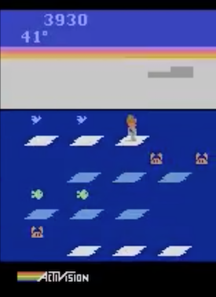

# Neuroevolution for Reinforcement Learning

Replication of [Uber AI Labs Neuroevolution paper](https://arxiv.org/pdf/1712.06567.pdf).

This is a complete rewrite of the code from OpenAI, Uber. The worker is implemented in tensorflow, and uses gym.
Workers communicate directly with a master Go server using gRPC. See `worker/` and `master/` for the code and
`proto/` for the generates stubs.

Click the images to see the trained agents in action. To my knowledge, this ice-hockey agent is *state-of-the-art.*

## Deployment

Deployment is done on AWS with cloudformation, allowing for one click deployment of an experiment with 100s of
workers, see `deploy/` for details.

Master is deployed on a dedicated EC2 instance, workers are provisioned on a spot fleet with 180-720 discrete cpu
cores. Both master and worker are packaged as docker images [available here](http://dockerhub.com/r/cshenton/neuro).

As far as HPC experiments go, this one is in the affordable range. Reaching 1 billion frames requires around
900 cpu core hours, which costs between $25-75USD on the AWS spot market. However, running the full atari suite
up to 4 billion frames would cost some thousands of dollars.

## Discussion

The simple master-worker architecutre made this a pleasure to implement, and cpu load on the master indicates
that it could seamlessly handle 200,000+ workers if need be (and more on a larger server). However I have some
observations on the limitations of this method for training policy networks:

- Vanilla GA is very susceptible to stochastic rewards
    - The elite run won't be the best policy
    - A lucky run from a poor policy can remain the elite for many generations
- As seeds get longer, network construction starts to dominate evaluation costs
    - Eventually this will crossover serialisation costs, quicker for smaller nets

Some performance enhancements that could be made to this implementation include.

- Compiling tensorflow to use AVX2, FMA instructions.
- Making sure docker doesn't share floating point cores between containers.

## ToDo

- Experiment 2
- Training Graphs
- Videos
- Utilities for trying out policies

### Some policies

[4070460811, 2393459932, 3391677529, 3126527182, 1530841827, 551825296, 2788280626, 3259895649, 491621571, 1975069066, 2436286981, 1561675863, 1783350318, 1327606738, 2368546632, 1861319266, 2926076564, 3244028662, 770972465, 682803462, 4187104692, 1531762673, 227312423, 687820495, 2693349394, 3452885796, 1637163948, 1847219188, 3239734781, 546358686, 3663099671, 2948785697, 2098781916, 3154979704, 3257521261, 4184203103, 1885360337, 2130262694]

[4070460811, 2393459932, 3391677529, 3126527182, 1530841827, 551825296, 2788280626, 3259895649, 491621571, 1975069066, 2436286981, 1561675863, 1783350318, 1327606738, 2368546632, 1861319266, 2926076564, 3244028662, 770972465, 682803462, 4187104692, 1531762673, 227312423, 687820495, 2693349394, 3452885796, 1637163948, 1847219188, 3239734781, 546358686, 1119816405, 1862569959, 4045600106, 3323378031, 3482377035, 2408647873, 992432518, 3136608193, 1829394318, 1543114441]

[4070460811, 2393459932, 3391677529, 3126527182, 1530841827, 551825296, 2788280626, 3259895649, 491621571, 1975069066, 2436286981, 1561675863, 1783350318, 1327606738, 2368546632, 1861319266, 2926076564, 3244028662, 770972465, 682803462, 4187104692, 1531762673, 227312423, 687820495, 2693349394, 3452885796, 1637163948, 1847219188, 3239734781, 546358686, 3944723327, 2251549834, 551244736, 2659881976, 2723408499, 3125959212, 3024698394, 312341439, 1481533847, 1751213060, 2773192657, 1242493479, 4240398627, 1935903898, 4273316625, 120186444]

[4070460811, 2393459932, 3391677529, 3126527182, 1530841827, 551825296, 2788280626, 3259895649, 491621571, 1975069066, 2436286981, 1561675863, 1783350318, 1327606738, 2368546632, 1861319266, 2926076564, 3244028662, 770972465, 682803462, 4187104692, 1531762673, 227312423, 687820495, 2693349394, 3452885796, 1637163948, 1847219188, 3239734781, 546358686, 3944723327, 2251549834, 551244736, 2659881976, 2723408499, 3125959212, 3024698394, 312341439, 1481533847, 1751213060, 2773192657, 1242493479, 4240398627, 1935903898, 4273316625]

[4070460811, 2393459932, 3391677529, 3126527182, 1530841827, 551825296, 2788280626, 3259895649, 491621571, 1975069066, 2436286981, 1561675863, 1783350318, 1327606738, 2368546632, 1861319266, 2926076564, 3244028662, 770972465, 682803462, 4187104692, 1531762673, 227312423, 687820495, 2693349394, 3452885796, 1637163948, 1847219188, 3239734781, 546358686, 3663099671, 2948785697, 2098781916, 3154979704, 3257521261, 4184203103, 1546417913, 1190962580, 1519291590, 4142039378, 2791828317, 794877055, 1407797410, 1212357677, 2357465736]

[4070460811, 2393459932, 3391677529, 3126527182, 1530841827, 551825296, 2788280626, 3259895649, 491621571, 1975069066, 2436286981, 1561675863, 1783350318, 1327606738, 2368546632, 1861319266, 2926076564, 3244028662, 770972465, 682803462, 4187104692, 1531762673, 227312423, 687820495, 2693349394, 3452885796, 1637163948, 1847219188, 3239734781, 546358686, 3663099671, 2948785697, 2098781916, 3154979704, 3257521261, 4184203103, 1546417913, 1190962580, 1519291590, 4142039378, 2791828317, 2885439578, 341938862, 1790688615, 2165249093]

[4070460811, 2393459932, 3391677529, 3126527182, 1530841827, 551825296, 2788280626, 3259895649, 491621571, 1975069066, 2436286981, 1561675863, 1783350318, 1327606738, 2368546632, 1861319266, 2926076564, 3244028662, 770972465, 682803462, 4187104692, 1531762673, 227312423, 687820495, 2693349394, 3452885796, 1637163948, 1847219188, 3239734781, 546358686, 3663099671, 2948785697, 2098781916, 3154979704, 3257521261, 4184203103, 1546417913, 1190962580, 1519291590, 4142039378, 2087398015, 2923945039, 2925837673, 4223546693, 1184104221, 3272207894]

[4070460811, 2393459932, 3391677529, 3126527182, 1530841827, 551825296, 2788280626, 3259895649, 491621571, 1975069066, 2436286981, 1561675863, 1783350318, 1327606738, 2368546632, 1861319266, 2926076564, 3244028662, 770972465, 682803462, 4187104692, 1531762673, 227312423, 687820495, 2693349394, 3452885796, 1637163948, 1847219188, 3239734781, 546358686, 3944723327, 2251549834, 551244736, 2659881976, 2723408499, 3125959212, 3024698394, 312341439, 1481533847, 1751213060, 2615306691, 812490633, 2078119438, 2090160661, 724766844, 3458845734]

[4070460811, 2393459932, 3391677529, 3126527182, 1530841827, 551825296, 2788280626, 3259895649, 491621571, 1975069066, 2436286981, 1561675863, 1783350318, 1327606738, 2368546632, 1861319266, 2926076564, 3244028662, 770972465, 682803462, 4187104692, 1531762673, 227312423, 687820495, 2693349394, 3452885796, 1637163948, 1847219188, 3239734781, 546358686, 3663099671, 2948785697, 2098781916, 3154979704, 3257521261, 4184203103, 1546417913, 1190962580, 1519291590, 4142039378, 2791828317, 794877055, 1407797410, 1212357677, 2357465736, 2331237694, 155839330, 3730261797, 2730616978, 3595209610, 3230716243]

[4070460811, 2393459932, 3391677529, 3126527182, 1530841827, 551825296, 2788280626, 3259895649, 491621571, 1975069066, 2436286981, 1561675863, 1783350318, 1327606738, 2368546632, 1861319266, 2926076564, 3244028662, 770972465, 682803462, 4187104692, 1531762673, 227312423, 687820495, 2436347868, 1827742750, 2029378539, 983443351, 3317892383, 3181143904, 206189380, 1488772059, 1594572977, 1868808599, 2988289214, 4078764900]